# 거점병원(HOSPITAL) 사용자 매뉴얼

**거점병원** 계정은 자기 병원의 선납 재고를 조회하고, 사용분을 등록·전송하며, 반납을 등록합니다.
모든 화면은 **자기 병원 데이터만** 표시됩니다(서버에서 자동 필터).

- **로그인 예시 계정**: `seoul@smartlogis.test` (서울대학교병원)
- **접근 메뉴**: 대시보드 · 메세지 · 재고 · 입출고(배송/반납) · 사용분(등록·이력) · 정산 · 관리(알림)

---

## 1. 대시보드

자기 병원 재고 현황, 월별 사용량 추이, 유통기한 임박 리스트를 봅니다.

- 화면 캡쳐: `images/hospital-dashboard.png`

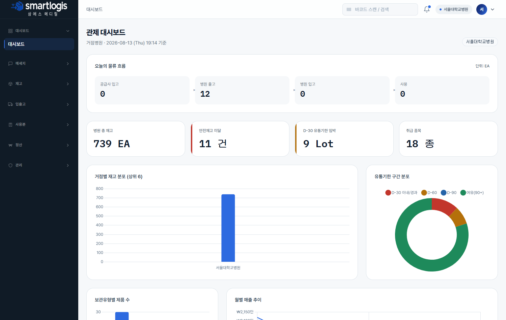

## 2. 메세지(채팅)

본사·창고 담당자와 채팅합니다.

- 화면 캡쳐: `images/hospital-chat.png`

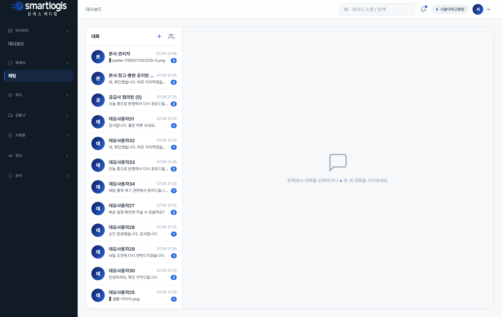

---

## 재고

### 3. 재고 현황

자기 병원 선납창고의 현재고를 제품·Lot·유통기한 단위로 조회합니다.

- 화면 캡쳐: `images/hospital-inventory-status.png`

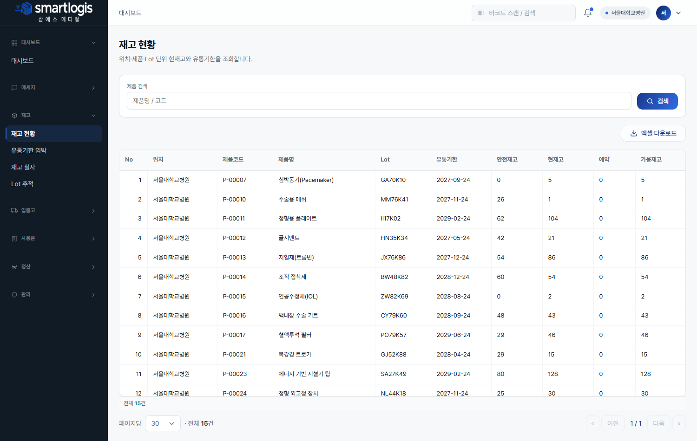

### 4. 유통기한 임박

D-30/60/90 임박 재고를 확인해 우선 사용·반납을 판단합니다.

- 화면 캡쳐: `images/hospital-inventory-expiry.png`

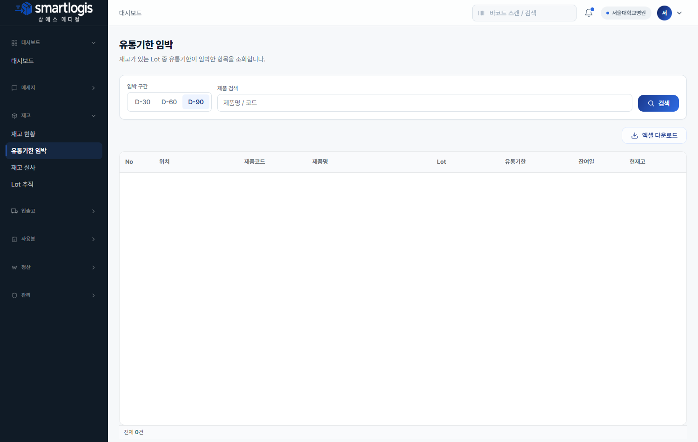

### 5. 재고 실사

자기 병원 재고를 실사합니다. **[실사 생성]** → 실사 수량 입력 → **[실사 확정]**(차이만큼 조정).

- 화면 캡쳐: `images/hospital-stocktakes.png`

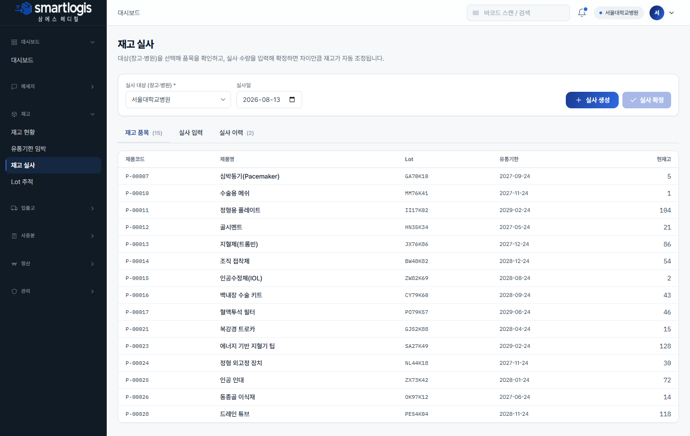

### 6. Lot 추적

특정 Lot 의 입고·사용 이력을 조회합니다.

- 화면 캡쳐: `images/hospital-lot-trace.png`

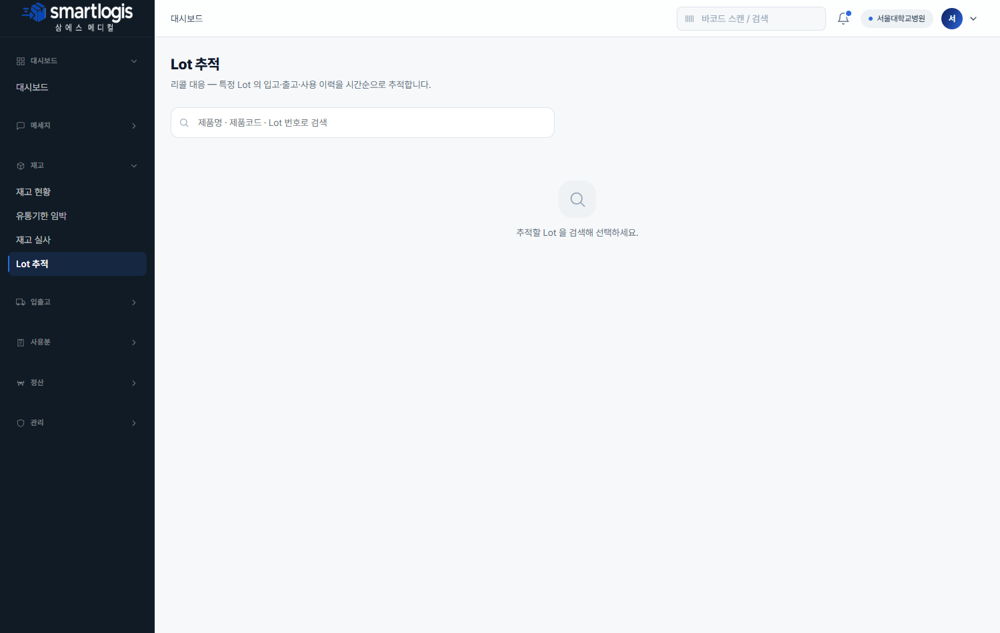

---

## 입출고

### 7. 배송 현황

창고에서 우리 병원으로 오는 출고/배송 상태를 확인합니다. 행 더블클릭으로 상세(품목) 조회.

- 화면 캡쳐: `images/hospital-outbound-delivery.png`

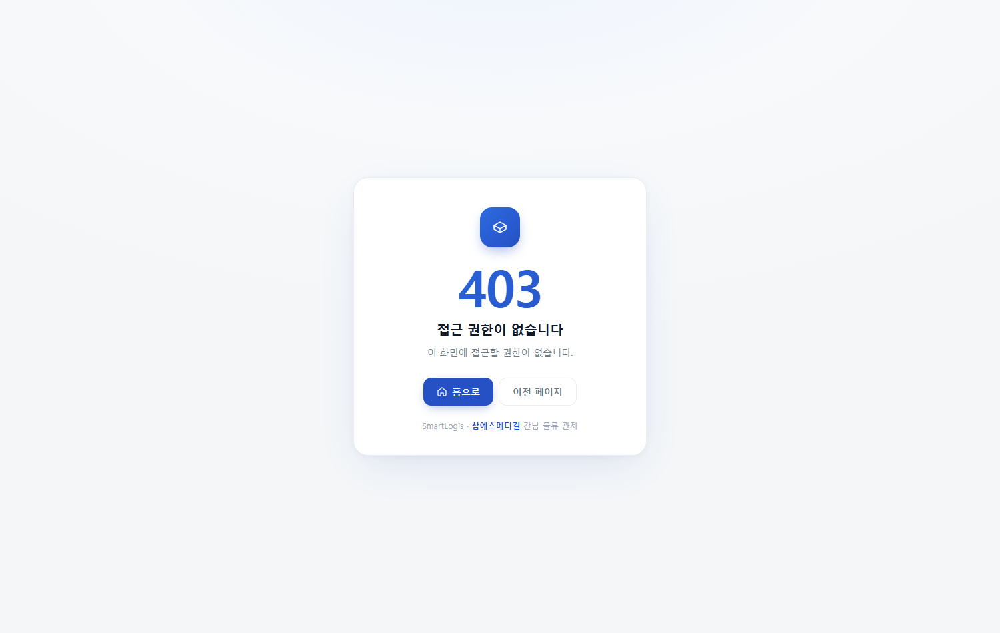

### 8. 반납 처리

미사용분을 병원→창고로 반납 등록합니다. **[+ 새 반납 등록]** 에서 보유 재고를 선택해 반납 수량을 입력합니다. 등록 후 행 더블클릭으로 상세 확인/배송 시작.

- 화면 캡쳐: `images/hospital-returns.png`

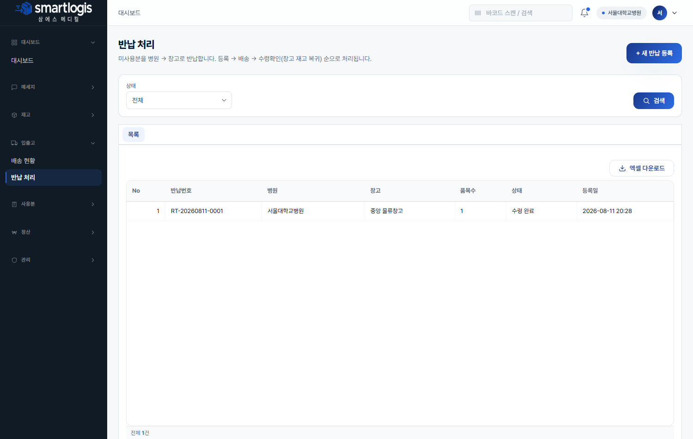

---

## 사용분

### 9. 사용분 등록 (핵심)

사용한 품목을 등록해 본사로 전송합니다.
- **사용일**·**매출 채널** 선택, **바코드 스캔** 또는 **재고에서 선택**으로 품목 추가, 부서·수량 입력.
- **[본사로 전송]** 하면 본사 승인 후 재고가 차감되고 정산에 반영됩니다.

- 화면 캡쳐: `images/hospital-usage-create.png`

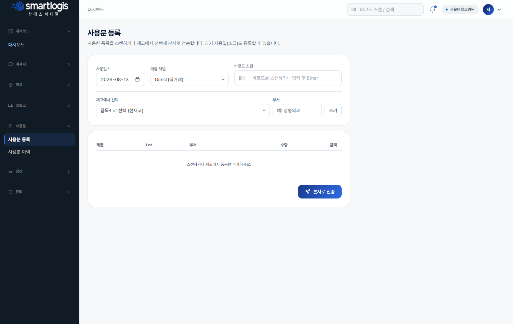

### 10. 사용분 이력

등록·전송·승인·반려된 우리 병원 사용분 내역을 조회합니다. 행 더블클릭으로 상세(품목·금액·반려사유).

- 화면 캡쳐: `images/hospital-usage-history.png`

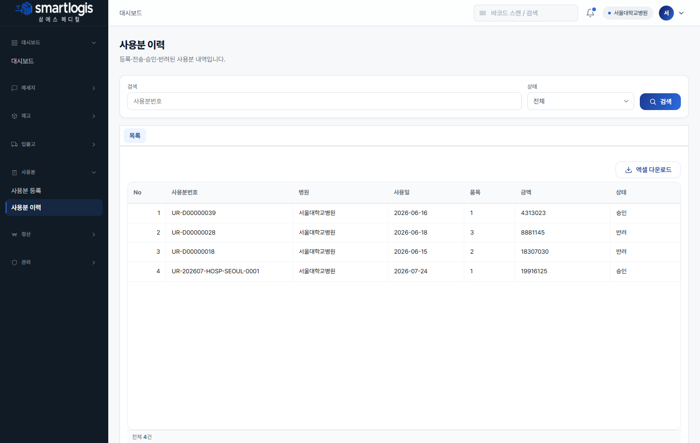

---

## 정산

### 11. 월 정산

우리 병원의 월별 매출(SALES) 정산 내역을 조회합니다.

- 화면 캡쳐: `images/hospital-settlement.png`

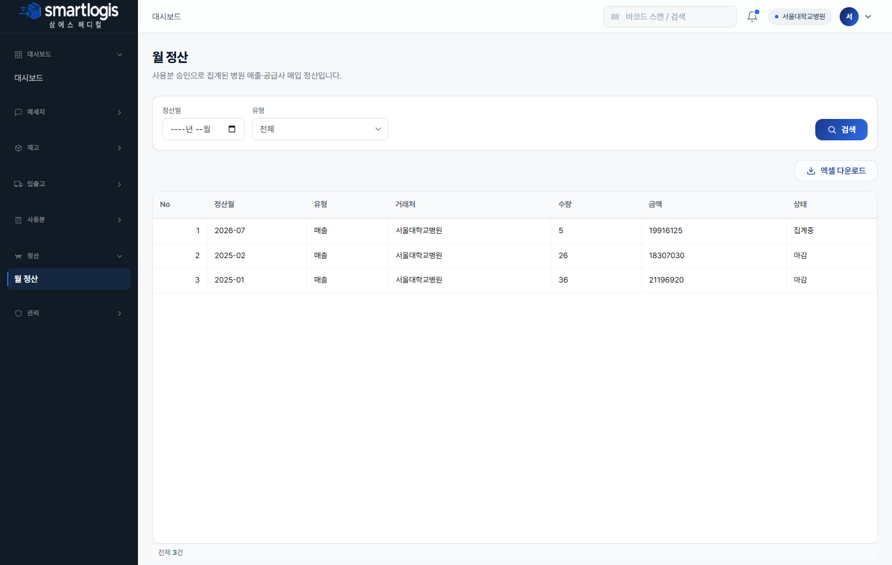

---

## 관리

### 12. 알림 센터

안전재고 미달·유통기한 임박·사용분 반려·공지 등 알림을 확인합니다.

- 화면 캡쳐: `images/hospital-notifications.png`

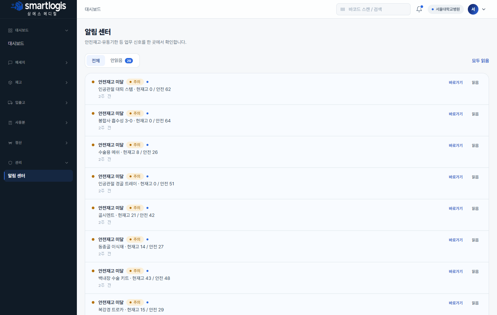
