# 본사(HQ) 사용자 매뉴얼

삼에스 **본사** 계정은 전체 데이터를 조회·관리하고, 마스터 등록, 사용분 승인, 정산·마감, 공지/감사 로그를 담당합니다.

- **로그인 예시 계정**: `hq@smartlogis.test`
- **접근 메뉴**: 대시보드 · 메세지 · 기준정보(전체) · 재고(전체) · 입출고(전체) · 사용분(승인·이력) · 정산 · 리포트 · 공급사 · 관리

---

## 1. 대시보드

전사 물류 KPI와 차트를 한눈에 봅니다: 오늘의 물류 흐름(입고/출고/사용), 승인 대기 사용분·안전재고 미달·유통기한 임박·활성 제품 카드, 거점별 재고 분포·유통기한 구간·월별 매출 추이 차트.

- 화면 캡쳐: `images/hq-dashboard.png`

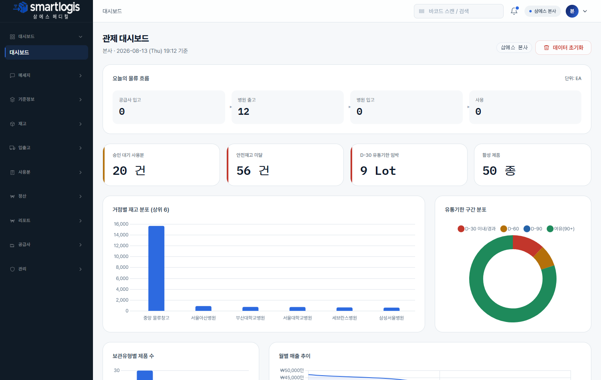

## 2. 메세지(채팅)

전사 사용자와 1:1·그룹 채팅. 좌측에서 대화 선택, 파일/이미지 첨부 가능. 대화방은 최근 1주일치를 먼저 불러오고 위로 스크롤하면 이전 대화를 더 불러옵니다.

- 화면 캡쳐: `images/hq-chat.png`

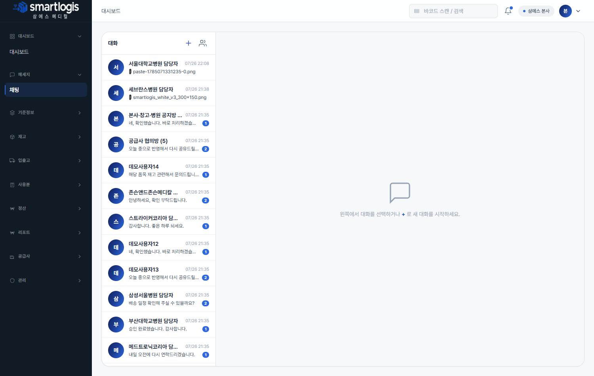

---

## 기준정보 (본사 전용)

### 3. 제품 마스터

의료 제품 마스터를 관리합니다. 그리드에서 셀을 더블클릭해 바로 편집, 행 추가/선택 삭제, **[엑셀 업로드]**(행 단위 검증 리포트)와 **[엑셀 다운로드]** 지원.

- 화면 캡쳐: `images/hq-products.png`

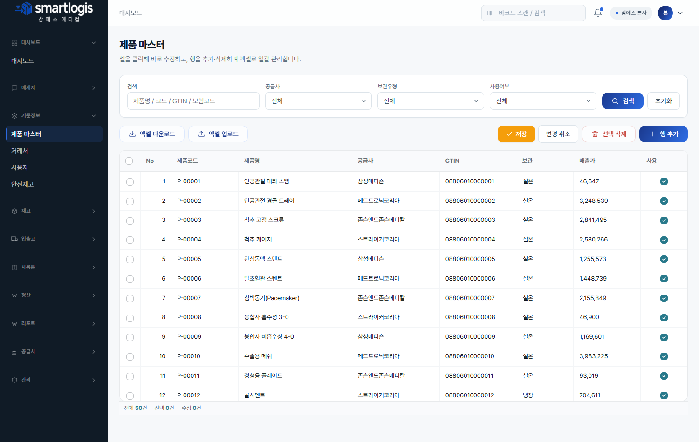

### 4. 거래처

병원·공급사·창고 등 거래처(조직)를 관리합니다. 유형/활성 필터, 인라인 편집, 엑셀 업/다운로드.

- 화면 캡쳐: `images/hq-organizations.png`

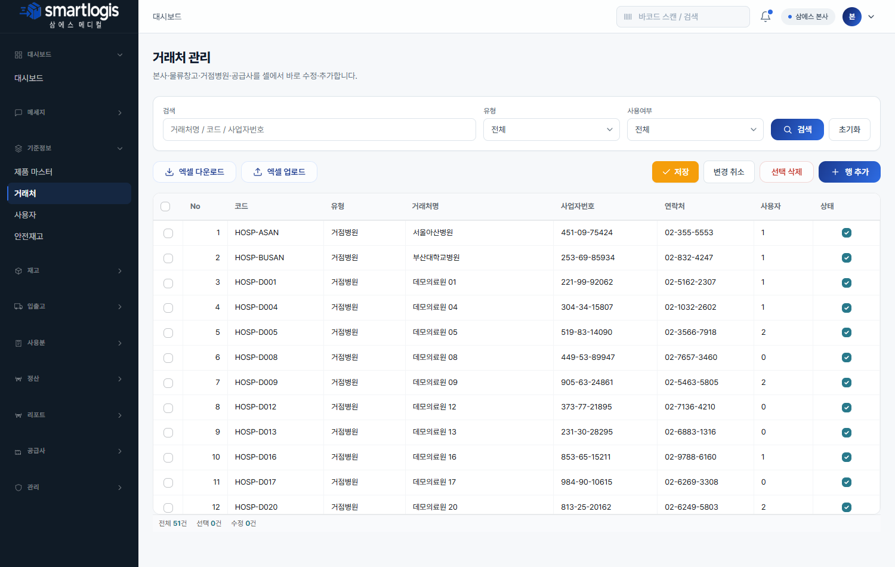

### 5. 사용자

사용자 계정·역할·소속 조직을 관리합니다. 신규 추가 시 임시 비밀번호가 발급됩니다.

- 화면 캡쳐: `images/hq-users.png`

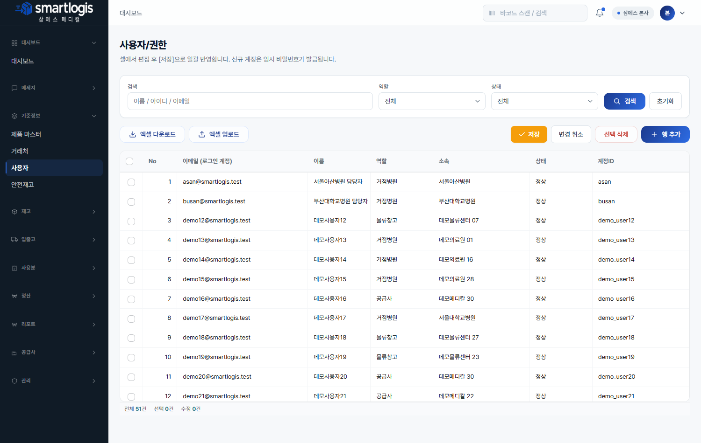

### 6. 안전재고

병원 × 품목 안전재고를 설정합니다. **병원 필터**로 좁히고, **[자동 산출]** 로 최근 사용량(월평균) 기반 추천값을 적용할 수 있습니다. 인라인 편집·엑셀 업/다운로드.

- 화면 캡쳐: `images/hq-safety-stocks.png`

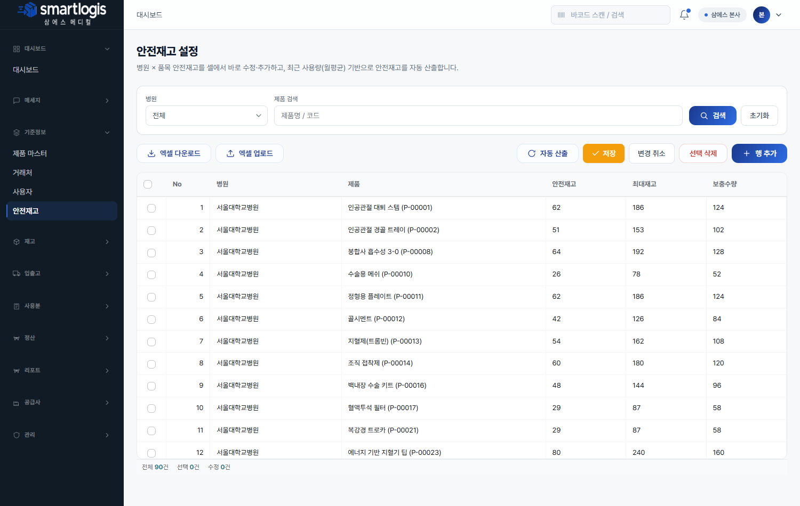

---

## 재고

### 7. 재고 현황

위치·제품·Lot·유통기한 단위 현재고를 조회합니다. **위치 필터**·제품 검색, 페이징(10/30/50/100), 엑셀 다운로드.

- 화면 캡쳐: `images/hq-inventory-status.png`

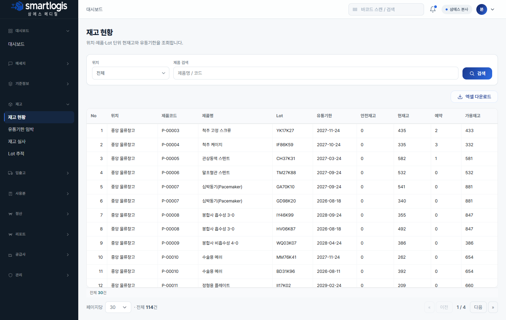

### 8. 유통기한 임박

D-30/60/90 구간별 임박 재고를 조회합니다. 위치 필터로 창고/병원별 확인.

- 화면 캡쳐: `images/hq-inventory-expiry.png`

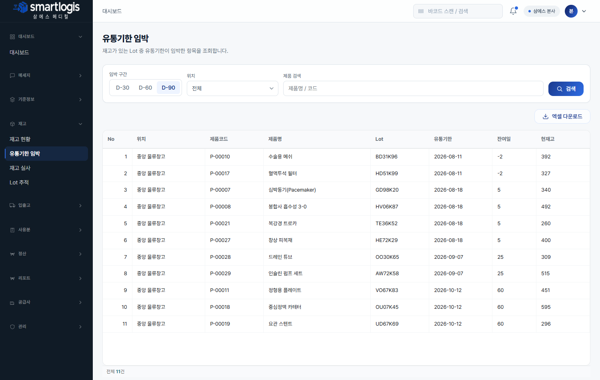

### 9. 재고 실사

대상(창고/병원)을 선택하면 해당 조직의 제품 품목이 표시됩니다. **[실사 생성]** 으로 현재고 스냅샷을 만들고, 실사 입력 탭에서 실사 수량을 입력한 뒤 **[실사 확정]** 하면 차이(diff)만큼 재고가 자동 조정됩니다.

- 화면 캡쳐: `images/hq-stocktakes.png`

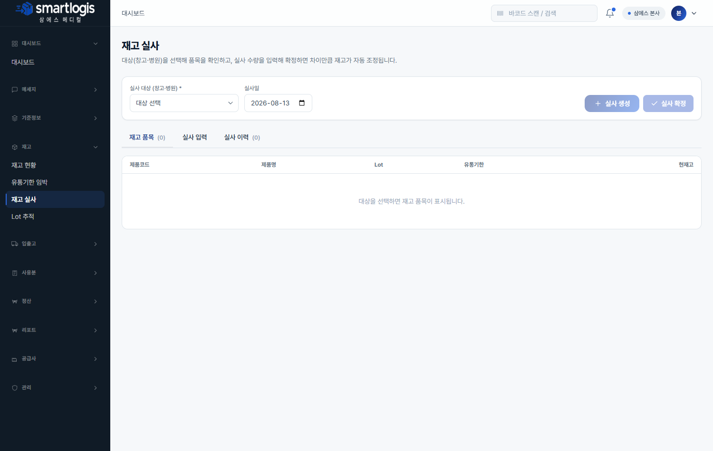

### 10. Lot 추적

제품명·제품코드·Lot 번호로 검색해 특정 Lot 의 창고 입고 → 병원 출고 → 사용 이력을 관통 조회합니다(리콜 대응).

- 화면 캡쳐: `images/hq-lot-trace.png`

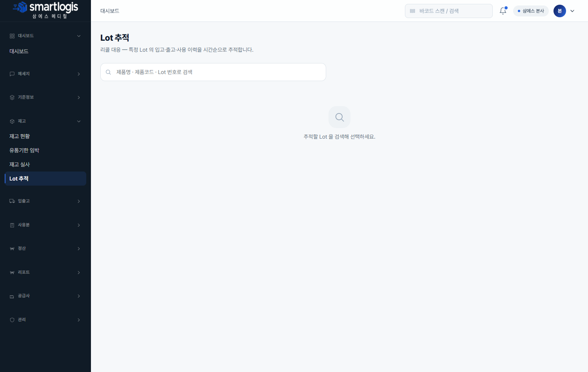

---

## 입출고

> 입고·출고·반납 리스트는 **행을 더블클릭**하면 상단에 상세 탭이 열립니다(기본정보/품목 + 처리 버튼).

### 11. 입고 예정(ASN)

공급사→창고 입고 예정을 관리합니다. **[ASN 등록]** 으로 예정 등록(스캔으로 품목 추가), 행 더블클릭 상세에서 라벨 출력·삭제.

- 화면 캡쳐: `images/hq-asn.png`

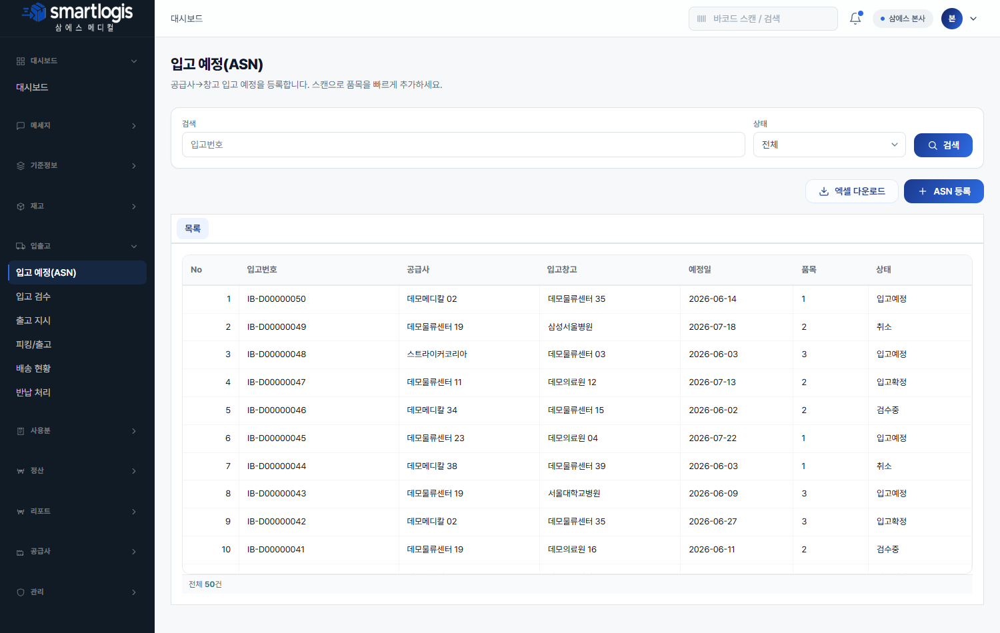

### 12. 입고 검수

입고 예정 문서를 검수·확정합니다. 행 더블클릭 → 상세에서 품목 확인 후 **[입고 확정]**(창고 재고 반영)·삭제·라벨.

- 화면 캡쳐: `images/hq-receiving.png`

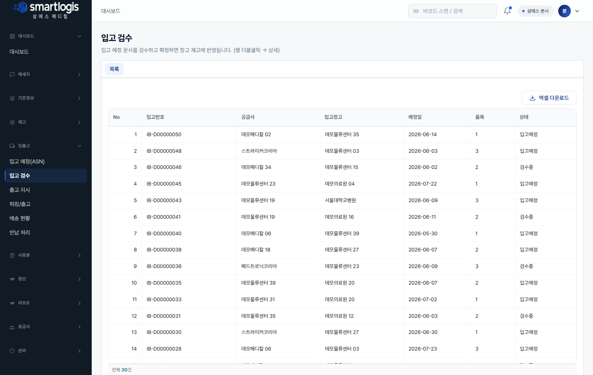

### 13. 출고 지시

창고→병원 출고를 지시합니다. **[출고 지시]** 로 창고·병원·품목을 지정해 등록, 행 더블클릭으로 상세 확인.

- 화면 캡쳐: `images/hq-outbound-order.png`

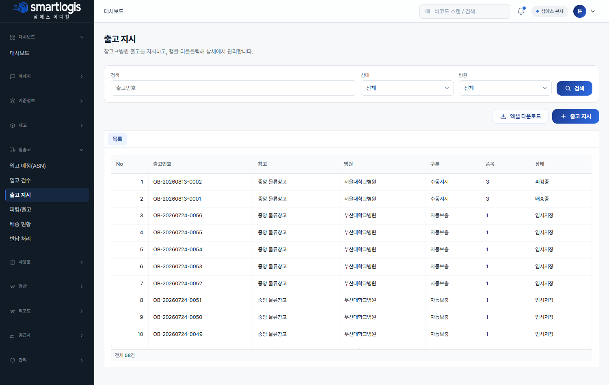

### 14. 피킹/출고

승인된 출고를 처리합니다. 행 더블클릭 → **품목 탭에서 피킹할 품목을 체크 선택 → [선택 피킹]**(FEFO 자동 Lot 배정·창고 재고 차감). 모든 품목 피킹 후 **[배송 시작]**.

- 화면 캡쳐: `images/hq-outbound-picking.png`

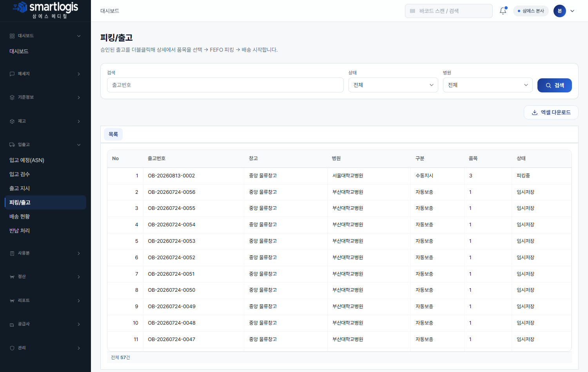

### 15. 배송 현황

배송 중/완료 출고를 확인합니다. 행 더블클릭 → **[배송 완료]** 시 병원 재고에 반영됩니다.

- 화면 캡쳐: `images/hq-outbound-delivery.png`

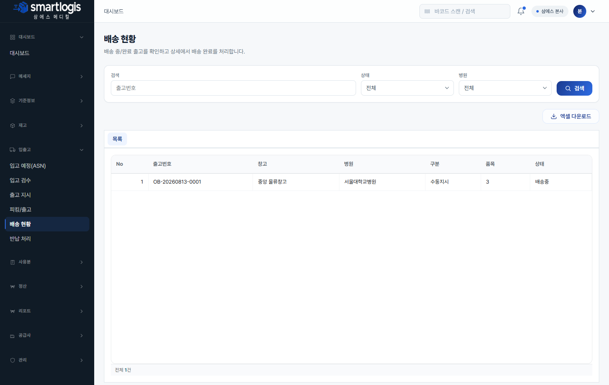

### 16. 반납 처리

병원→창고 반납을 관리합니다. 행 더블클릭 → 상세에서 배송 시작 / **[수령확인]**(병원 재고 차감·창고 재고 복귀) / 취소.

- 화면 캡쳐: `images/hq-returns.png`

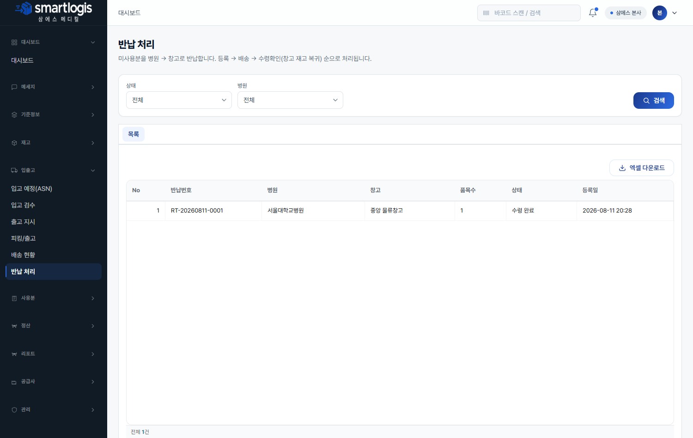

---

## 사용분

### 17. 사용분 승인

병원이 전송한 사용분을 승인/반려합니다. 행 더블클릭 → 상세에서 품목·금액 확인 후 **[승인]**(병원 재고 차감 + SALES/PURCHASE 정산 생성) 또는 **[반려]**(사유 입력). 병원 필터로 좁혀서 확인.

- 화면 캡쳐: `images/hq-usage-approval.png`

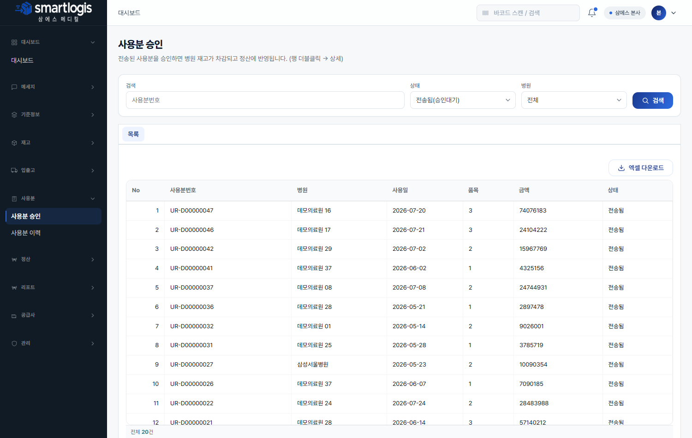

### 18. 사용분 이력

전 병원의 사용분(등록·전송·승인·반려) 내역을 조회합니다. 병원·상태 필터, 행 더블클릭 상세.

- 화면 캡쳐: `images/hq-usage-history.png`

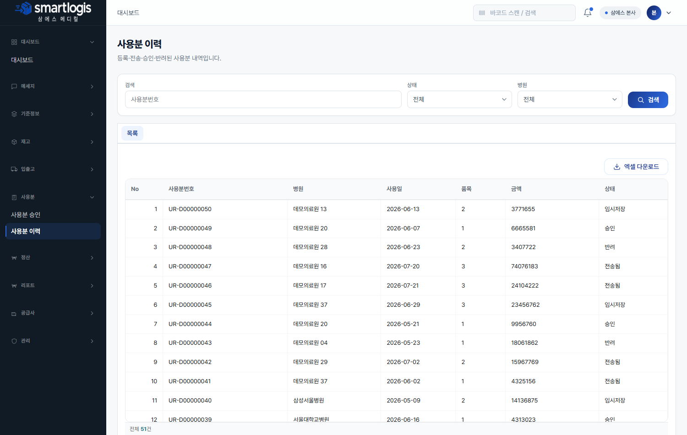

---

## 정산

### 19. 월 정산

월별 정산(병원 매출 SALES / 공급사 매입 PURCHASE)을 조회합니다. 정산월·유형·병원 필터, 엑셀 다운로드.

- 화면 캡쳐: `images/hq-settlement.png`

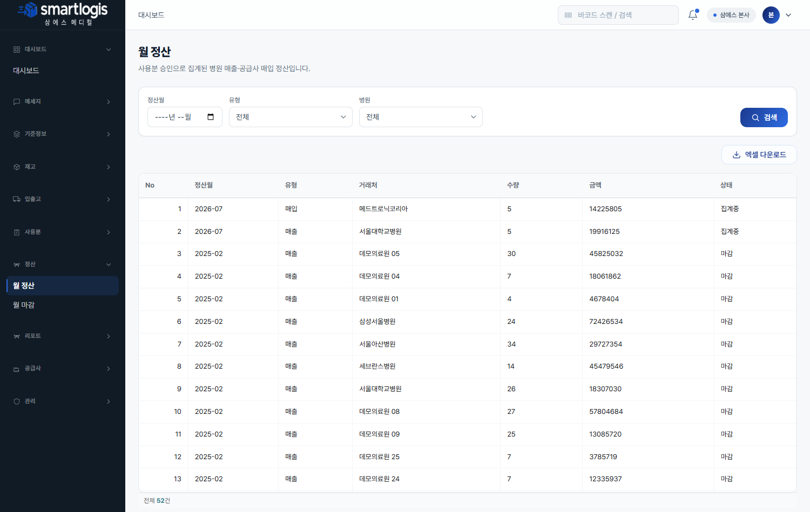

### 20. 월 마감

연월 단위로 마감합니다. 마감된 월은 데이터 생성·수정이 차단됩니다. 마감/마감 취소는 감사 로그에 기록됩니다.

- 화면 캡쳐: `images/hq-closing.png`

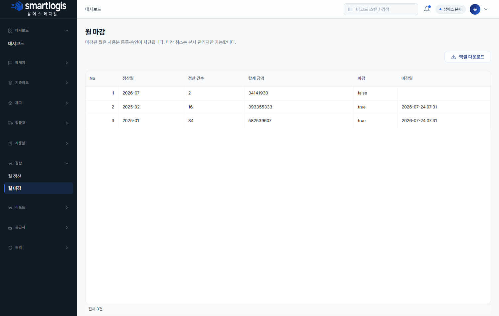

---

## 리포트

### 21. 채널별 매출

승인된 사용분(매출)을 GPO·Direct·3PL·수술·온라인 채널별로 집계합니다. 기간·병원 필터.

- 화면 캡쳐: `images/hq-report-channel.png`

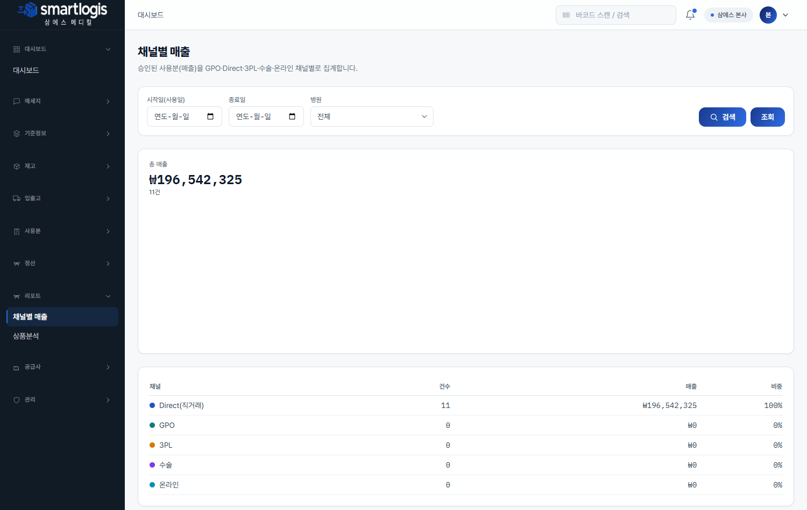

### 22. 상품분석

품목별 사용량·매출·현재고·회전(사용량/현재고)을 분석합니다. 기간·병원 필터.

- 화면 캡쳐: `images/hq-report-product.png`

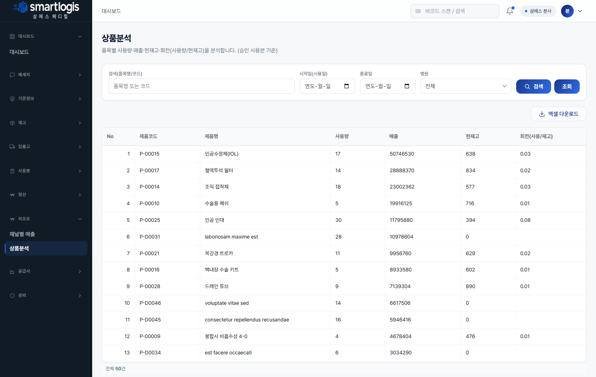

---

## 공급사

### 23. 자사 재고

공급사 제품의 병원별 재고를 조회합니다(본사는 공급사 선택 가능).

- 화면 캡쳐: `images/hq-supplier-stocks.png`

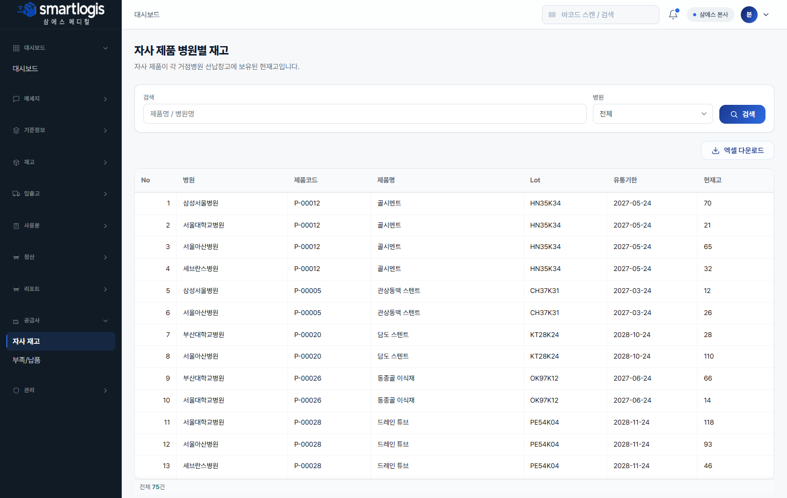

### 24. 부족/납품

안전재고 미달로 납품이 필요한 품목을 조회합니다.

- 화면 캡쳐: `images/hq-supplier-shortages.png`

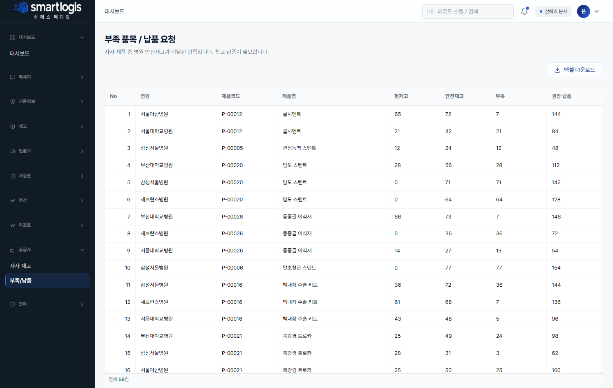

---

## 관리

### 25. 알림 센터

안전재고 미달·유통기한 임박·사용분 상태·공지 등 알림을 확인합니다. HQ 는 알림 삭제/읽음 처리 가능.

- 화면 캡쳐: `images/hq-notifications.png`

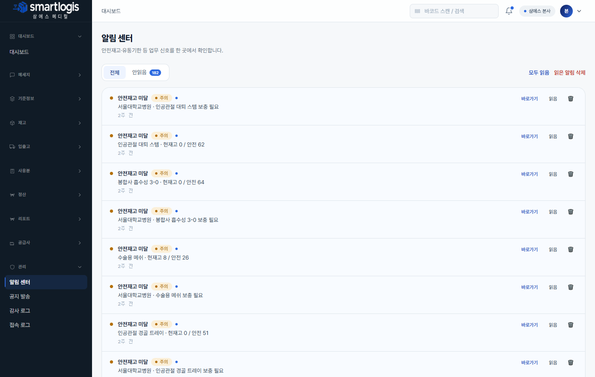

### 26. 공지 발송

전체/역할/조직 대상으로 공지를 발송합니다(웹 알림 + FCM 푸시).

- 화면 캡쳐: `images/hq-announcements.png`

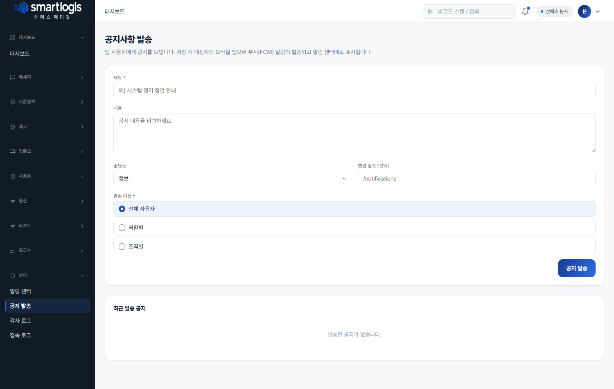

### 27. 감사 로그

생성·수정·삭제·승인·반려·마감 등 주요 작업 이력을 조회합니다. 사용자·작업·기간 필터.

- 화면 캡쳐: `images/hq-audit-logs.png`

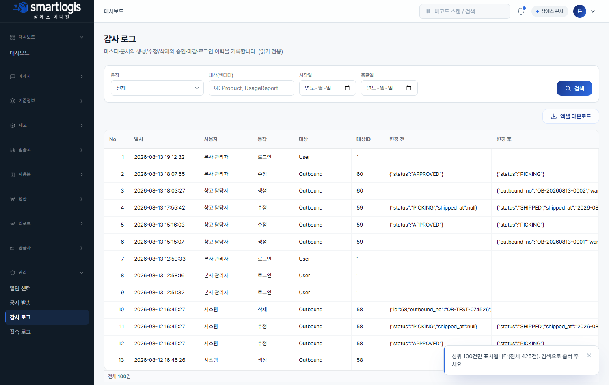

### 28. 접속 로그

사용자 접속(경로·IP·시각) 이력을 조회합니다.

- 화면 캡쳐: `images/hq-access-logs.png`

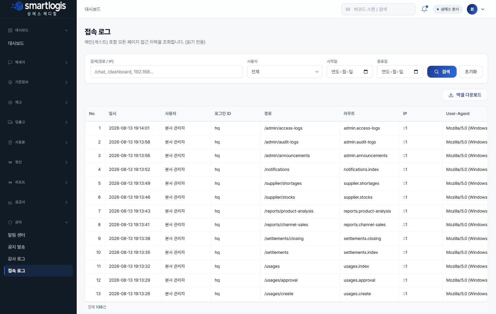
