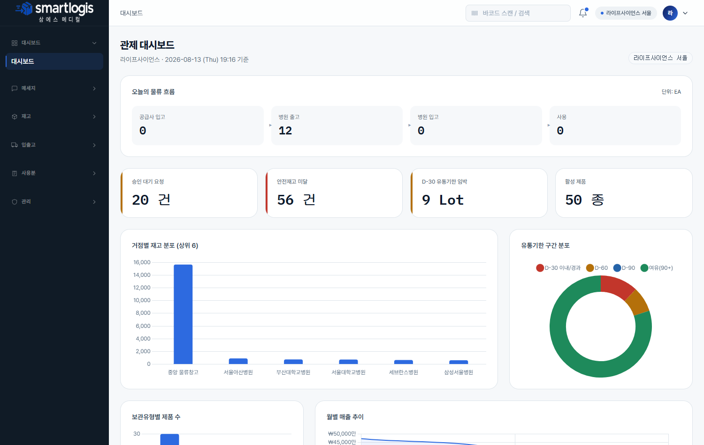
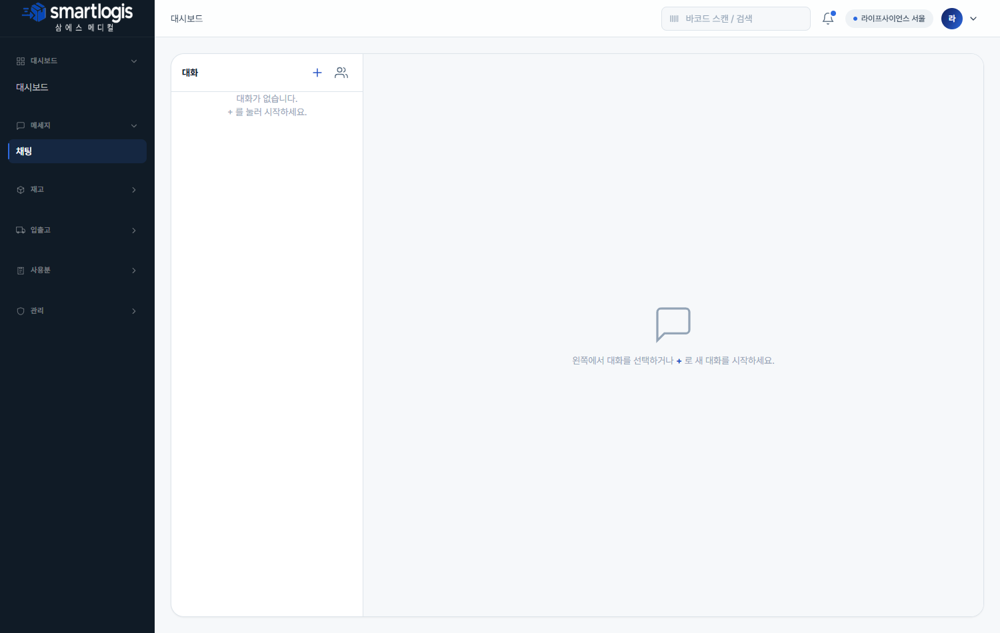
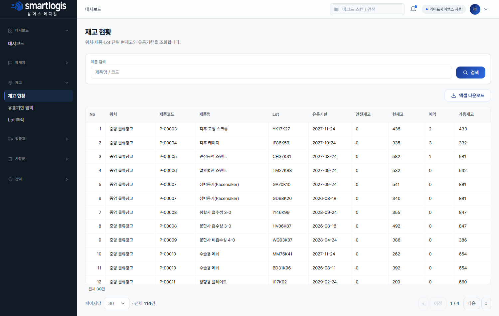
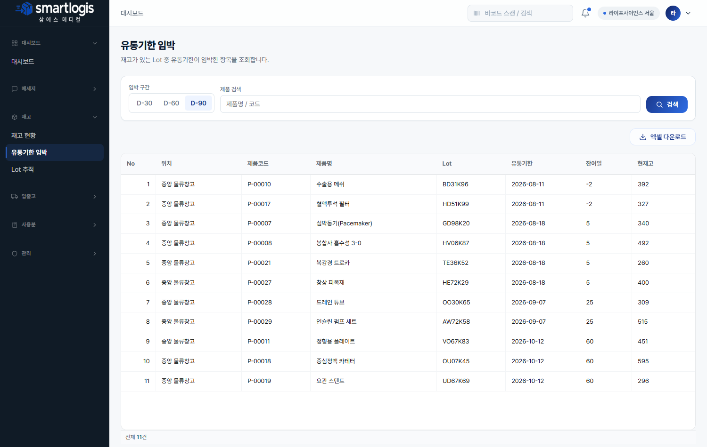
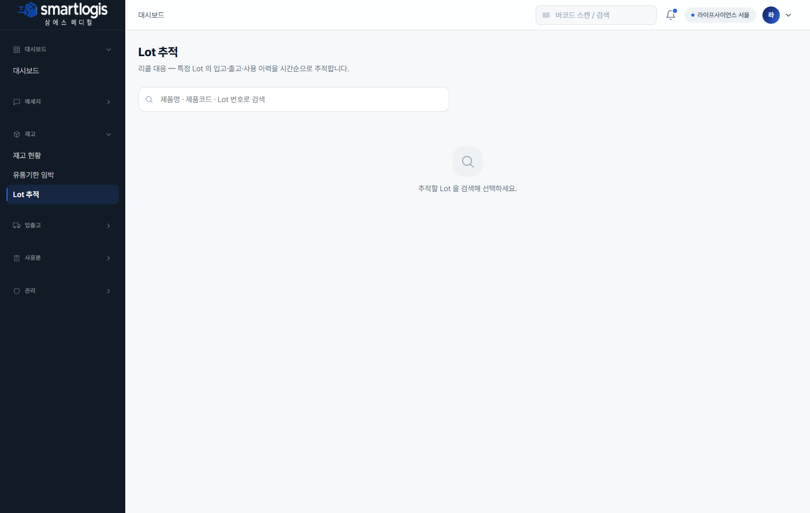
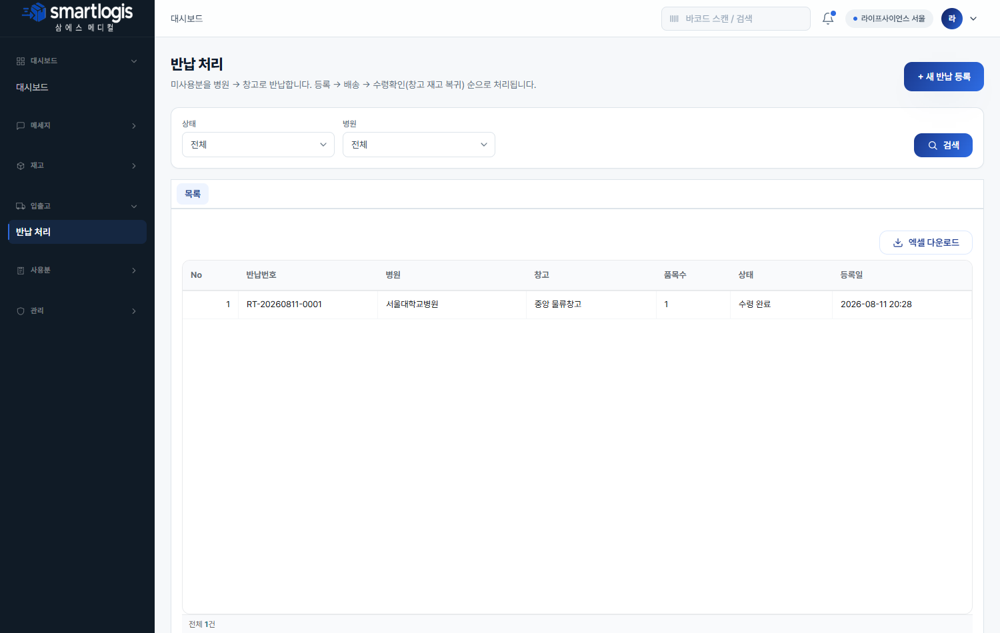
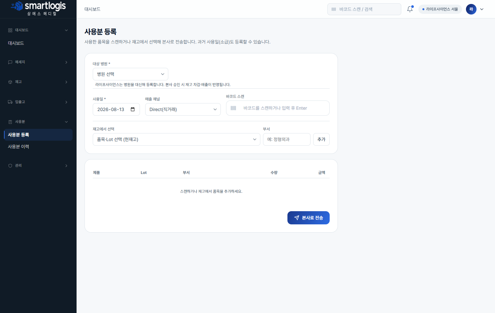
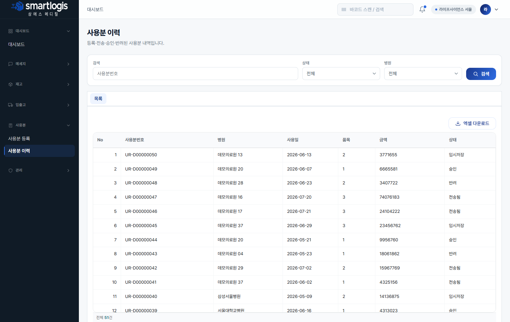
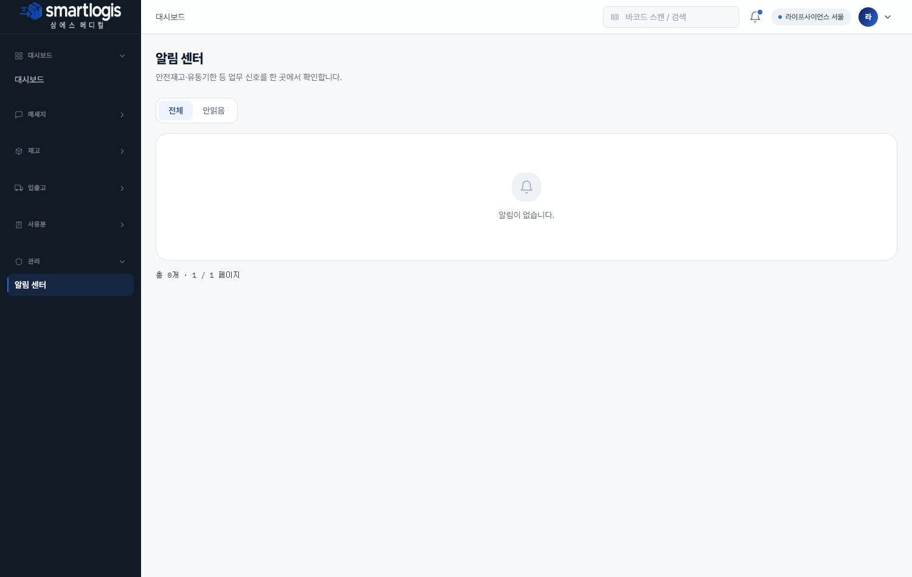

# 라이프사이언스(LIFE) 사용자 매뉴얼

**라이프사이언스** 계정은 병원 재고를 조회하고, 병원을 지정해 사용분을 등록·전송하며, 반납을 등록하는 요청/사용 대행 역할입니다.
재고·사용분 등은 넓게 조회하되, 사용분 등록·반납 시 **대상 병원을 선택**합니다.

- **로그인 예시 계정**: `life1@smartlogis.test`
- **접근 메뉴**: 대시보드 · 메세지 · 재고(현황/유통기한/Lot) · 입출고(반납) · 사용분(등록·이력) · 관리(알림)

---

## 1. 대시보드

담당 범위의 재고·사용 현황을 봅니다.

- 화면 캡쳐: `images/life-dashboard.png`

## 2. 메세지(채팅)

본사·병원 담당자와 채팅합니다.

- 화면 캡쳐: `images/life-chat.png`

---

## 재고

### 3. 재고 현황

병원별 현재고를 제품·Lot·유통기한 단위로 조회합니다. 병원/위치 필터.

- 화면 캡쳐: `images/life-inventory-status.png`

### 4. 유통기한 임박

D-30/60/90 임박 재고를 확인합니다.

- 화면 캡쳐: `images/life-inventory-expiry.png`

### 5. Lot 추적

특정 Lot 의 입고·출고·사용 이력을 조회합니다.

- 화면 캡쳐: `images/life-lot-trace.png`

---

## 입출고

### 6. 반납 처리

미사용분을 병원→창고로 반납 등록합니다. **[+ 새 반납 등록]** 에서 **반납 병원 선택** 후 보유 재고에서 반납 수량을 입력합니다.

- 화면 캡쳐: `images/life-returns.png`

---

## 사용분

### 7. 사용분 등록 (핵심)

**대상 병원을 선택**하고 사용 품목을 등록해 본사로 전송합니다. 사용일·매출 채널 지정, 바코드 스캔 또는 재고에서 선택으로 품목 추가.

- 화면 캡쳐: `images/life-usage-create.png`

### 8. 사용분 이력

등록·전송·승인·반려된 사용분 내역을 조회합니다. 병원·상태 필터, 행 더블클릭 상세.

- 화면 캡쳐: `images/life-usage-history.png`

---

## 관리

### 9. 알림 센터

사용분 상태·유통기한 임박 등 알림을 확인합니다.

- 화면 캡쳐: `images/life-notifications.png`

