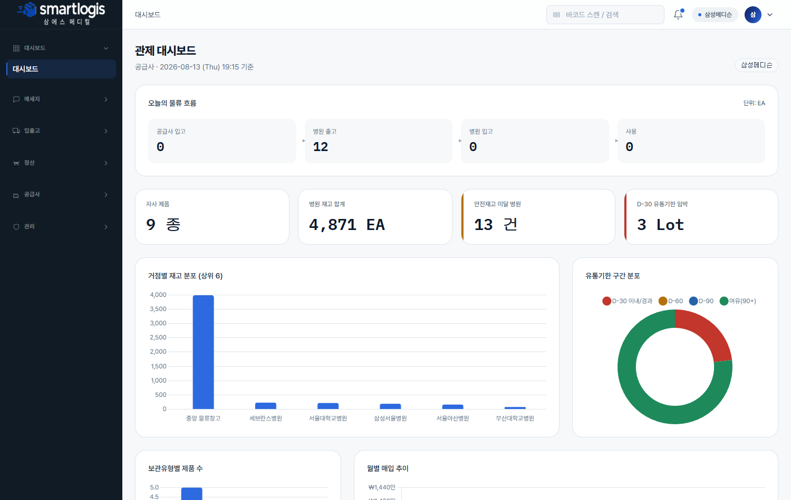
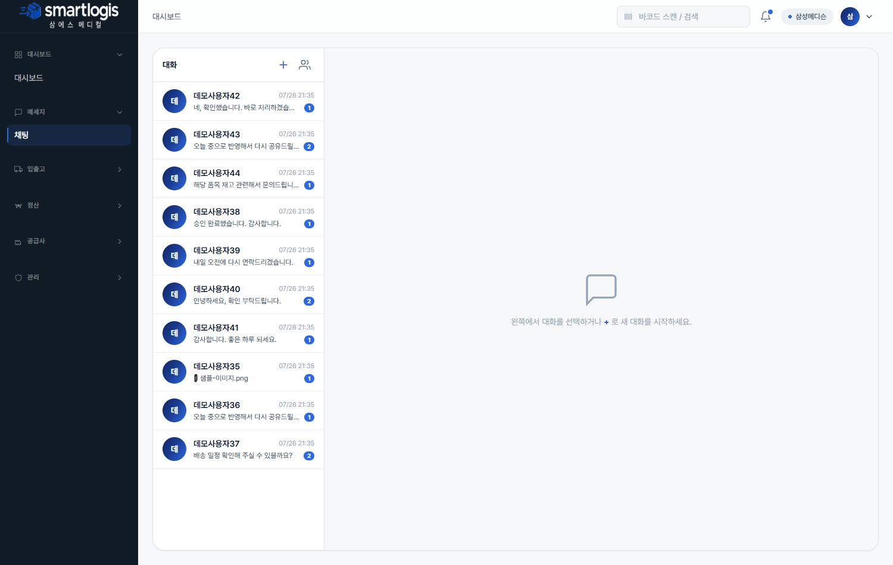
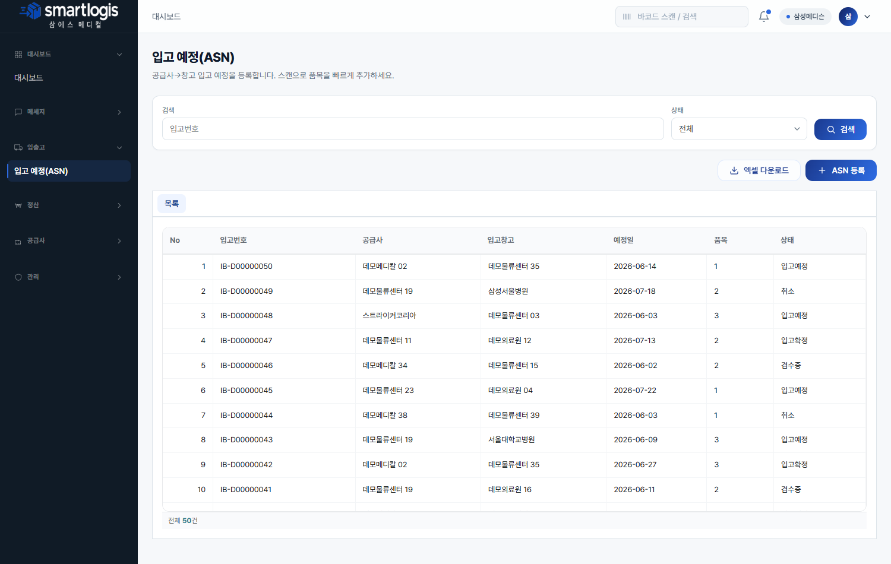
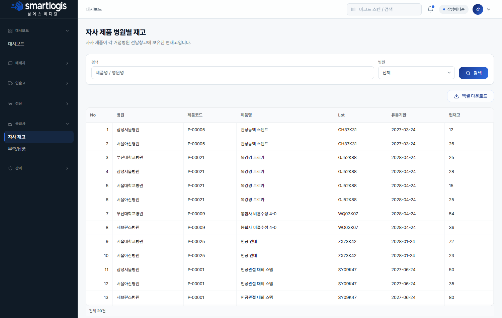
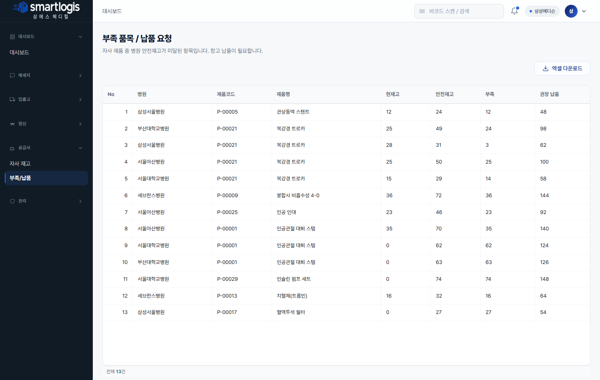
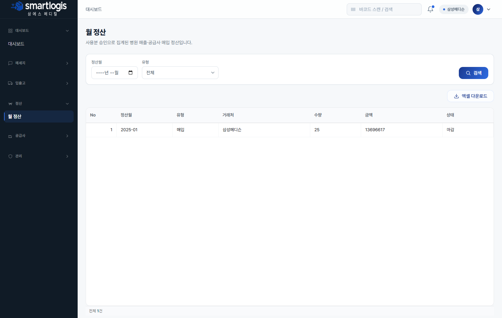
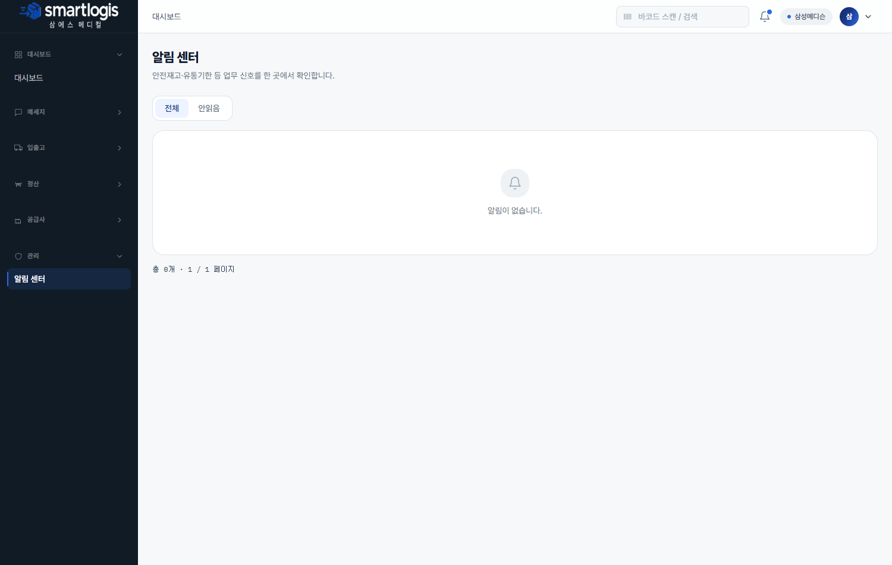

# 공급사(SUPPLIER) 사용자 매뉴얼

**공급사** 계정은 자사 제품의 병원별 재고를 조회하고, 부족 품목에 대응(납품)하며, 입고 예정(ASN)을 등록하고, 매입 정산을 확인합니다.
모든 화면은 **자사 제품 데이터만** 표시됩니다(서버에서 자동 필터).

- **로그인 예시 계정**: `sup-samsung@smartlogis.test`
- **접근 메뉴**: 대시보드 · 메세지 · 입출고(ASN) · 정산 · 공급사 · 관리(알림)

---

## 1. 대시보드

자사 제품의 병원별 재고, 부족 발생 품목, 납품 진행 현황을 봅니다.

- 화면 캡쳐: `images/supplier-dashboard.png`

## 2. 메세지(채팅)

본사·창고 담당자와 채팅합니다.

- 화면 캡쳐: `images/supplier-chat.png`

---

## 입출고

### 3. 입고 예정(ASN)

자사 제품의 창고 입고 예정을 등록합니다. **[ASN 등록]** 에서 창고·품목을 지정(스캔으로 빠르게 추가), 행 더블클릭으로 상세 확인.

- 화면 캡쳐: `images/supplier-asn.png`

---

## 공급사

### 4. 자사 재고

자사 제품이 각 거점병원 선납창고에 보유된 현재고를 조회합니다. 병원·제품 검색.

- 화면 캡쳐: `images/supplier-supplier-stocks.png`

### 5. 부족/납품

안전재고 미달로 납품이 필요한 품목을 조회하고 납품을 준비합니다.

- 화면 캡쳐: `images/supplier-supplier-shortages.png`

---

## 정산

### 6. 월 정산

자사 제품의 월별 매입(PURCHASE) 정산 내역을 조회합니다.

- 화면 캡쳐: `images/supplier-settlement.png`

---

## 관리

### 7. 알림 센터

자사 제품 부족·납품 요청 등 알림을 확인합니다.

- 화면 캡쳐: `images/supplier-notifications.png`

