# 물류창고(WAREHOUSE) 사용자 매뉴얼

삼에스 **물류창고** 계정은 입고 검수·창고 재고 관리, 출고 피킹/배송, 반납 수령을 담당합니다.

- **로그인 예시 계정**: `wh1@smartlogis.test`
- **접근 메뉴**: 대시보드 · 메세지 · 재고 · 입출고 · 관리(알림)

---

## 1. 대시보드

창고 관점 KPI/차트: 금일 입출고, 배송 상태, 재고 회전 등.

- 화면 캡쳐: `images/warehouse-dashboard.png`

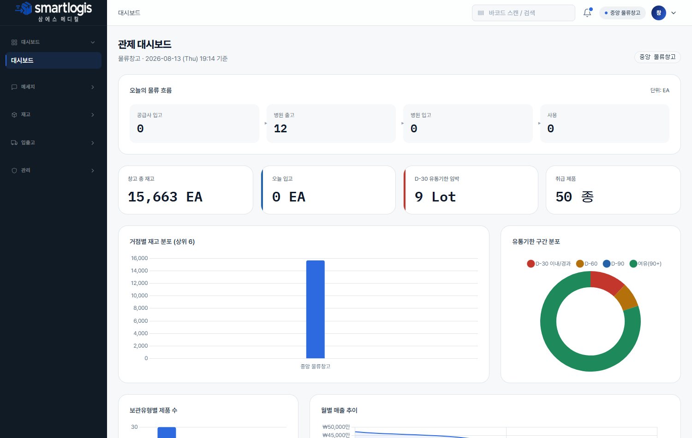

## 2. 메세지(채팅)

본사·병원·공급사 담당자와 채팅합니다.

- 화면 캡쳐: `images/warehouse-chat.png`

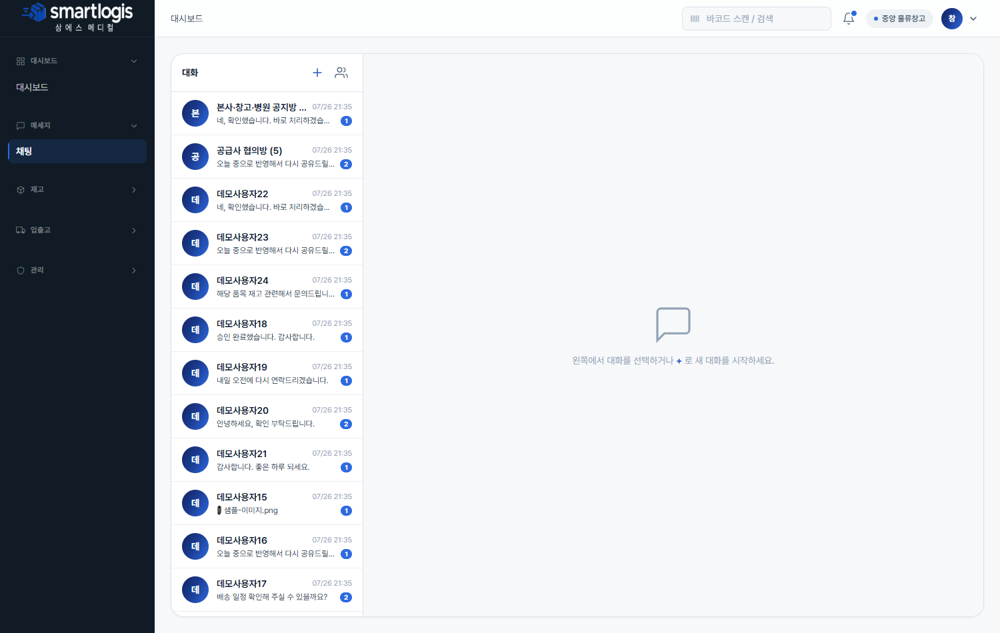

---

## 재고

### 3. 재고 현황

창고 보유 재고를 위치·제품·Lot·유통기한 단위로 조회합니다. 페이징·엑셀 다운로드.

- 화면 캡쳐: `images/warehouse-inventory-status.png`

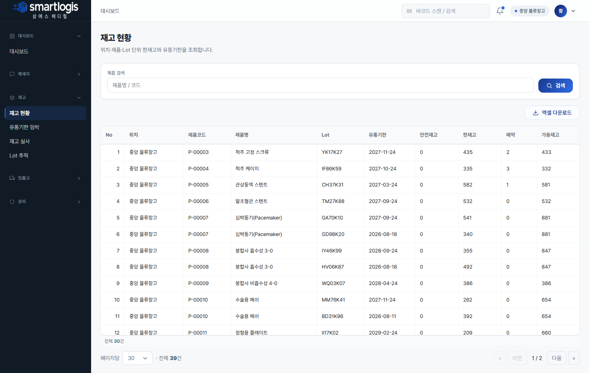

### 4. 유통기한 임박

D-30/60/90 임박 재고를 확인해 선출고/반납 대상을 파악합니다.

- 화면 캡쳐: `images/warehouse-inventory-expiry.png`

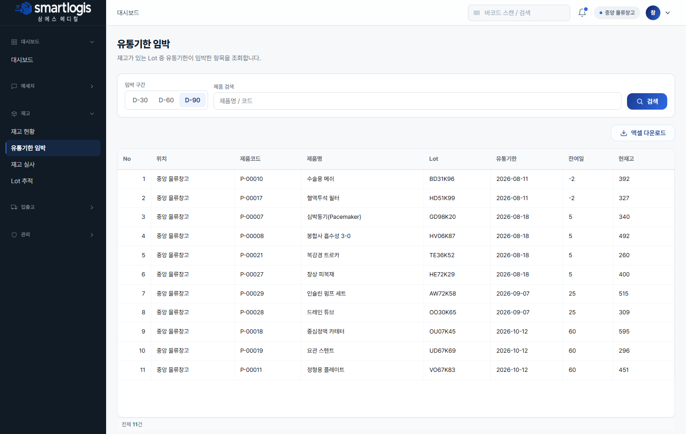

### 5. 재고 실사

대상 창고 선택 → **[실사 생성]**(현재고 스냅샷) → 실사 수량 입력 → **[실사 확정]**(차이만큼 재고 조정).

- 화면 캡쳐: `images/warehouse-stocktakes.png`

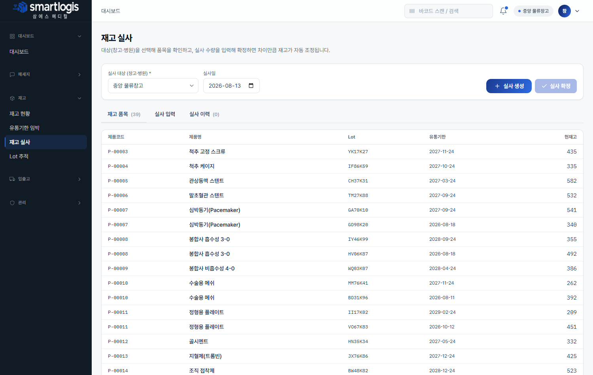

### 6. Lot 추적

특정 Lot 의 입고→출고→사용 이력을 추적합니다(리콜 대응).

- 화면 캡쳐: `images/warehouse-lot-trace.png`

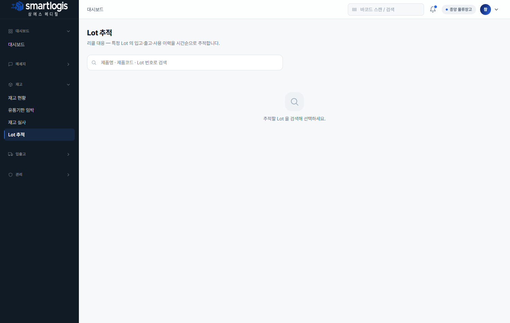

---

## 입출고

> 리스트에서 **행을 더블클릭**하면 상단에 상세 탭이 열립니다(기본정보/품목 + 처리 버튼).

### 7. 입고 예정(ASN)

공급사가 등록한 입고 예정을 확인하고, 필요 시 직접 등록합니다.

- 화면 캡쳐: `images/warehouse-asn.png`

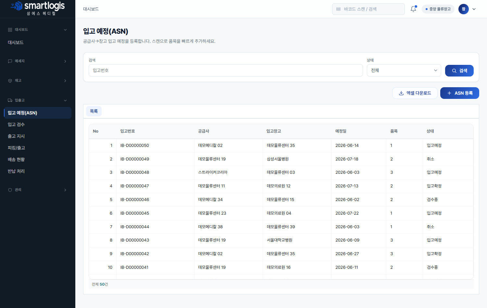

### 8. 입고 검수

입고 문서를 검수·확정합니다. 행 더블클릭 → 상세에서 품목(제품·Lot·유통기한·수량) 확인 후 **[입고 확정]** 하면 창고 재고에 반영됩니다. 스캔으로 품목 대조, 라벨 출력 가능.

- 화면 캡쳐: `images/warehouse-receiving.png`

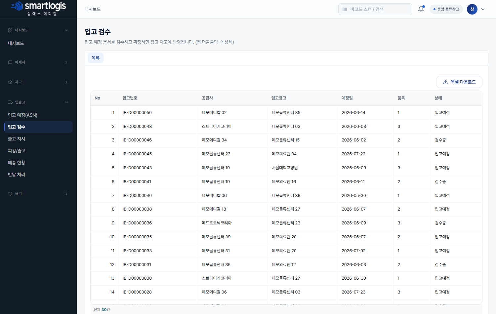

### 9. 출고 지시

창고→병원 출고 지시를 등록/조회합니다.

- 화면 캡쳐: `images/warehouse-outbound-order.png`

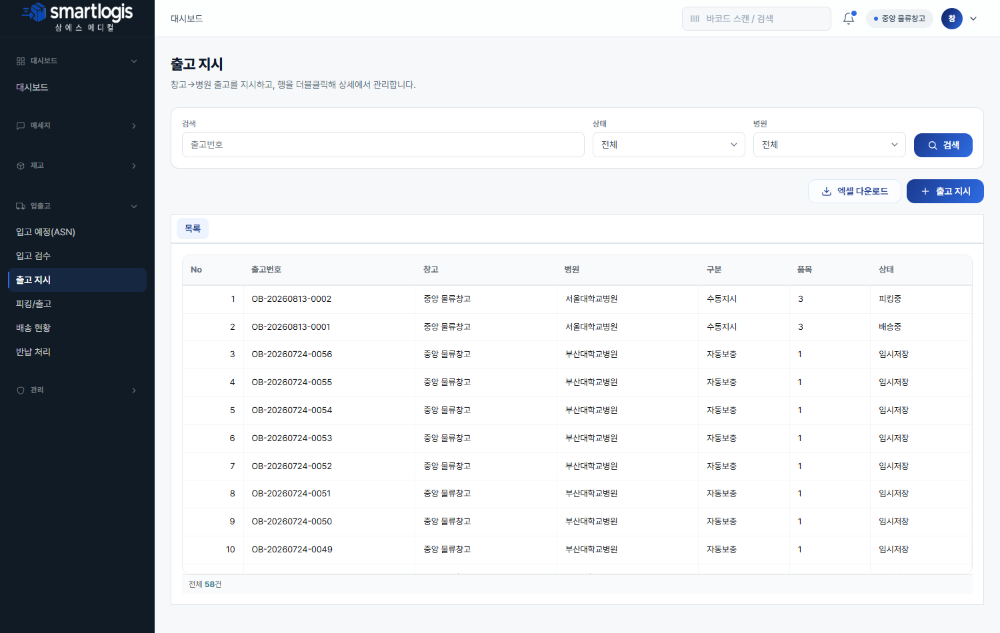

### 10. 피킹/출고 (핵심)

승인된 출고를 처리합니다. 행 더블클릭 → **품목 탭에서 피킹할 품목을 체크 → [선택 피킹]**(FEFO: 유통기한 임박 순 자동 Lot 배정, 창고 재고 차감). 전 품목 피킹 완료 시 **[배송 시작]**.

- 화면 캡쳐: `images/warehouse-outbound-picking.png`

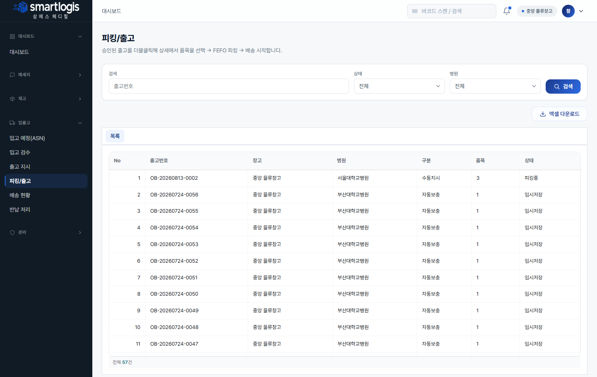

### 11. 배송 현황

배송 중/완료 출고를 관리합니다. 행 더블클릭 → **[배송 완료]** 처리 시 병원 재고에 반영됩니다.

- 화면 캡쳐: `images/warehouse-outbound-delivery.png`

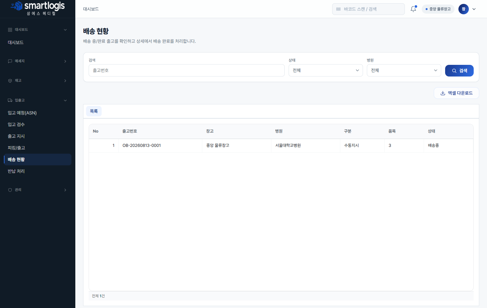

### 12. 반납 처리

병원이 등록한 반납을 처리합니다. 행 더블클릭 → 상세에서 배송 시작 / **[수령확인]**(병원 재고 차감·창고 재고 복귀).

- 화면 캡쳐: `images/warehouse-returns.png`

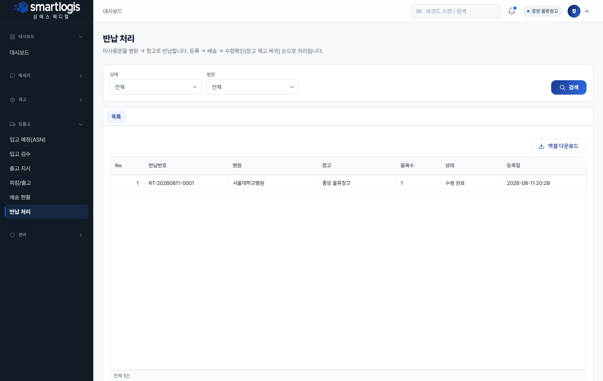

---

## 관리

### 13. 알림 센터

입고 지연·유통기한 임박·자동 보충 등 창고 관련 알림을 확인합니다.

- 화면 캡쳐: `images/warehouse-notifications.png`

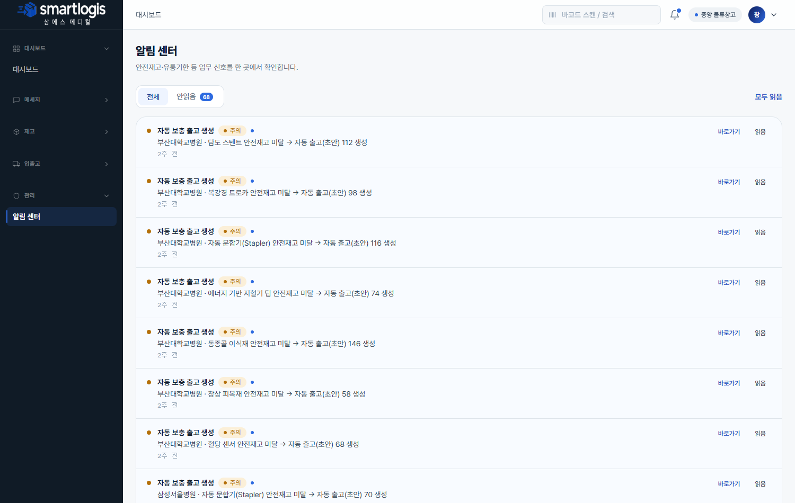
